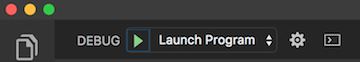

# Prime Solo Project
As a student at Prime Digital Academy, I was given 2 weeks to create an app of my choosing. The main requirement was for it to be a full stack application (database to front end). We were provided a base repository with user side authentication.  

I was required to create a scoping document in order to get my project approve. Here is a link to my original scope via Google Docs https://docs.google.com/document/d/1slDlMRmjlFrBdInhptoqbZJNvoSCrzVkexCo5xxHdWI/edit?usp=sharing.
It includes, wire frames, schedule, base mode (MVP), possible stretch goals, and database documentation. 

---

## Application Overview

My app will help with planning weekly menus and seeing what ingredients you need. It will add to Nikko Miu's "My Little Cookbook" app that stores our personal family recipes. It will use the recipe API from "My Little Cookbook" to pull in all available recipes. 

## Problems
- Getting home late and not knowing what I am going to have for dinner.
- Going to the grocery store and only buying staple food items.
- Having to run out to pick up an item after I have already started dinner.
- Buying a special ingredient for a recipe and forgetting what recipe.

## Current App Downfalls
- Too many ads!
- Paid services 
- Don’t make a cumulative shopping list
- Focused on dieting
- More complicated than necessary

## Solution
My Little Meal Planner app will use my personal recipes to plan meals for specific dates. 


Stretch Mode #1: 
User will have the ability to set reminders connected with specific meals. Example reminders: 1) 7am “remember to get the chicken out to defrost”  2) 4pm “time to start making the pizza dough” 3) Extra stretch: “you have not meal planned for tonight”.  The reminders will be send via SMS text message using https://www.twilio.com/. 

Stretch Mode #2: 
User will be able to view a cumulative list of all the necessary ingredients for all planned meals for a specific date range (default to week). 


---
#Original Directions
---
# Prime Project
This version uses React, Redux, Express, Passport, and PostgreSQL (a full list of dependencies can be found in `package.json`).

We **STRONGLY** recommend following these instructions carefully. It's a lot, and will take some time to set up, but your life will be much easier this way in the long run.

## Prerequisites

Before you get started, make sure you have the following software installed on your computer:

- [Node.js](https://nodejs.org/en/)
- [PostrgeSQL](https://www.postgresql.org/)
- [Nodemon](https://nodemon.io/)

## Create database and table

Create a new database called `prime_app` and create a `person` table:

```SQL
CREATE TABLE person (
    id SERIAL PRIMARY KEY,
    username VARCHAR (80) UNIQUE NOT NULL,
    password VARCHAR (1000) NOT NULL
);
```

If you would like to name your database something else, you will need to change `prime_app` to the name of your new database name in `server/modules/pool.js`

## Download (Don't Clone) This Repository

* Don't Fork or Clone. Instead, click the `Clone or Download` button and select `Download Zip`.
* Unzip the project and start with the code in that folder.
* Create a new GitHub project and push this code to the new repository.

## Development Setup Instructions

* Run `npm install`
* Create a `.env` file at the root of the project and paste this line into the file:
    ```
    SERVER_SESSION_SECRET=superDuperSecret
    ```
    While you're in your new `.env` file, take the time to replace `superDuperSecret` with some long random string like `25POUbVtx6RKVNWszd9ERB9Bb6` to keep your application secure. Here's a site that can help you: [https://passwordsgenerator.net/](https://passwordsgenerator.net/). If you don't do this step, create a secret with less than eight characters, or leave it as `superDuperSecret`, you will get a warning.
* Start postgres if not running already by using `brew services start postgresql`
* Run `npm run server`
* Run `npm run client`
* Navigate to `localhost:3000`

## Debugging

To debug, you will need to run the client-side separately from the server. Start the client by running the command `npm run dev:client`. Start the debugging server by selecting the Debug button.


Then make sure `Launch Program` is selected from the dropdown, then click the green play arrow.




## Production Build

Before pushing to Heroku, run `npm run build` in terminal. This will create a build folder that contains the code Heroku will be pointed at. You can test this build by typing `npm start`. Keep in mind that `npm start` will let you preview the production build but will **not** auto update.

* Start postgres if not running already by using `brew services start postgresql`
* Run `npm start`
* Navigate to `localhost:5000`

## Lay of the Land

* `src/` contains the React application
* `public/` contains static assets for the client-side
* `build/` after you build the project, contains the transpiled code from `src/` and `public/` that will be viewed on the production site
* `server/` contains the Express App

This code is also heavily commented. We recommend reading through the comments, getting a lay of the land, and becoming comfortable with how the code works before you start making too many changes. If you're wondering where to start, consider reading through component file comments in the following order:

* src/components
  * App/App
  * Footer/Footer
  * Nav/Nav
  * AboutPage/AboutPage
  * InfoPage/InfoPage
  * UserPage/UserPage
  * LoginPage/LoginPage
  * RegisterPage/RegisterPage
  * LogOutButton/LogOutButton
  * ProtectedRoute/ProtectedRoute

## Deployment

1. Create a new Heroku project
1. Link the Heroku project to the project GitHub Repo
1. Create an Heroku Postgres database
1. Connect to the Heroku Postgres database from Postico
1. Create the necessary tables
1. Add an environment variable for `SERVER_SESSION_SECRET` with a nice random string for security
1. In the deploy section, select manual deploy

## Update Documentation

Customize this ReadMe and the code comments in this project to read less like a starter repo and more like a project. Here is an example: https://gist.github.com/PurpleBooth/109311bb0361f32d87a2
